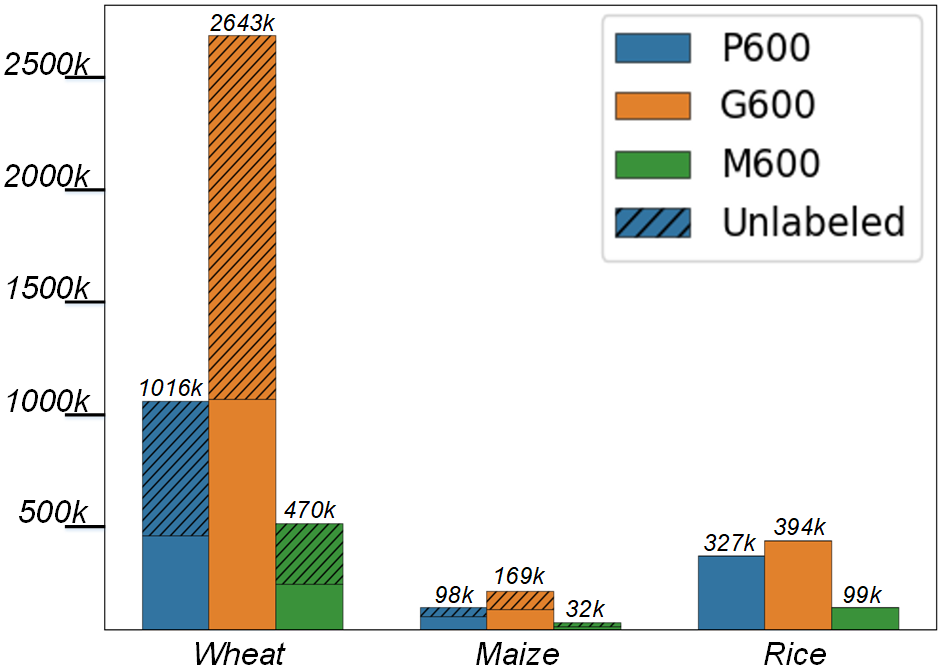

# GrainSpace

Paper  [*GrainSpace*: A Large-scale Dataset for Fine-grained and Domain-adaptive Recognition of Cereal Grains](https://arxiv.org/pdf/2203.05306.pdf)

Work done when interning in [Gaozhe Technology](http://gaozhe.com.cn/) 

## Introduction

This is the project page for *GrainSpace*,  to the best of our knowledge, this is the first publicly released dataset for cereal grain inspections. Cereal grains are a vital part of human diets and are important commodities for people’s livelihood and international trade. Grain Appearance Inspection (GAI) serves as one of the crucial steps for the determination of grain quality and grain stratification for proper circulation, storage and food processing, etc. GAI is routinely performed manually by qualified inspectors with the aid of some hand tools. Therefore, our goal is to  build automated GAI that has the benefit of greatly assisting inspectors with their jobs.

We believe that smart agriculture is a critical research field for social good and a large dataset can lead to significant advancement in CV techniques for this field. We hope that *GrainSpace* can stimulate and draw more attention to the development of intelligent agriculture,  triggering more researchers to devote themselves  to smart agriculture, helping countries with food security, quality of food, etc. We believe computer vision techniques can revolutionize GAI-related applications.


## Dataset

*GrainSpace* includes a total of 5.25 million images determined by professional inspectors, since all extra matters (*e.g.*, impurities or foreign cereals) in raw grain samples are removed manually. The grain samples including wheat, maize and rice are collected from five countries and more than 30 regions. Considering the manufacturing cost and reproducibility of data devices, we construct three types of device prototypes for data acquisition: Professional-600 (P600), General-600 (G600) and Mobile-600 (M600).




### TRAIN & VAL

The training and val sets can be accessed after contacting with us. 

**The *GrainSpace* dataset is licensed under the Creative Commons BY-NC-SA 4.0 license.** **Note that All data must not be used for commercial purposes.**


### TEST 

- we release the whole test dataset: [baiduyun (PSD: nvvn)](https://pan.baidu.com/s/1dNASszevSRLOTb6VOJIbRw) ,  partal dataset: [google drive](https://drive.google.com/drive/folders/1_G0Ho4YgbgNMEdUorUI2Gji0Dz4rp9Yh?usp=sharing)
- We don't have enough google drive space for releasing all TEST data. please refer to the baiduyun, or contact with us and then we figure out other methods.


### FAQ

FAQ1: About data imbalance

- Wheat/Maize data imbalance is due to the nature of cereal grains. Generally, the proportion of DU-grains in wheat samples is very small, since more than 10% DU-grains mean there are very serious quality problems. 
- Data imbalance between devices is due to the fact that we built G600 about 3 years ago, and then P600 and M600 (1 year ago), and different devices possess various levels of sampling efficiency.


FAQ2: About Unlabeled data

- Unlabeled data refer to that some grain samples are determined by inspectors to pick out extra matters but **are not** divided into DU-categories. 


FAQ3: About Wheat region grouping standard

- We combine wheat grains from China as $R_{1-14}$, Australia as $R_{15-18}$, and USA and Canada together as $R_{19-22}$, in which grains within the same group
  share similar appearance.


## Benchmark

We formulate GAI as three ubiquitous computer vision tasks: fine-grained recognition, domain adaptation and out-of-distribution recognition.  Detailed benchmarking results can be found in the results folder.


### Fine-grained Recognition

ResNet50:

- Pytorch implementation
- [Wheat](https://drive.google.com/drive/folders/19Ce635pVnSF0GbQt5DdZJxHTkFH2SuJE?usp=sharing)


DCL

- Code: https://github.com/JDAI-CV/DCL
- [Wheat](https://drive.google.com/drive/folders/1ECxIWuZh6sYOCj-GhqKzLIsLCkrcE7HG?usp=sharing)


SwimT

- [Wheat](https://drive.google.com/drive/folders/1RpXNA_v5gBuoUbDL6day3-gy9zbOk6MB?usp=sharing)


MixMatch

- Code: https://github.com/YU1ut/MixMatch-pytorch
- Pre-trained: Wheat, [Maize](https://drive.google.com/drive/folders/12vJ2akDo7-hqldlDC3UDh6z3yf2aDZco?usp=sharing), [Rice](https://drive.google.com/drive/folders/1kQlIMOYxxQpoK7x8ZLwVACdbZ61z96Xr?usp=sharing)


MoCo

- Code: https://github.com/facebookresearch/moco
- Pre-trained: [Wheat](https://drive.google.com/drive/folders/1YQLOfb-rjhlgiUjnYPQPXJdtzmXICDAw?usp=sharing) , [Maize](https://drive.google.com/drive/folders/1z94mkzcaywyrEvw0eMGZ0ctyRUlPz2hG?usp=sharing) , [Rice](https://drive.google.com/drive/folders/1zmrdYhdOTom4GC0MSO4Mn2xUIMF7XO0_?usp=sharing)


### Domain Adaptation

#### CDAN

- Code: https://github.com/thuml/Transfer-Learning-Library

#### MCD

- Code: https://github.com/mil-tokyo/MCD_DA

#### MCC

- Code: https://github.com/thuml/Versatile-Domain-Adaptation


### Out-of-distribution 

#### Deep SVDD

- Code: https://github.com/lukasruff/Deep-SVDD-PyTorch

#### Rot

- Code:https://github.com/hendrycks/ss-ood  and https://github.com/drumpt/RotNet-OOD

#### CSI

- Code:  https://github.com/alinlab/CSI


## Citation

```
@InProceedings{GrainSpace_2022_CVPR,
author = {Lei Fan, Yiwen Ding, Dongdong Fan, Donglin Di, Maurice Pagnucco, Yang Song},
title = {GrainSpace: A Large-scale Dataset for Fine-grained and Domain-adaptive Recognition of Cereal Grains},
booktitle = {Proceedings of the IEEE/CVF Conference on Computer Vision and Pattern Recognition (CVPR)},
month = {June},
year = {2022},
}
```


# TODO


- [ ] put more benchmarking results
- [ ] finish the camera-ready version (both paper and supp material)
- [ ] 


